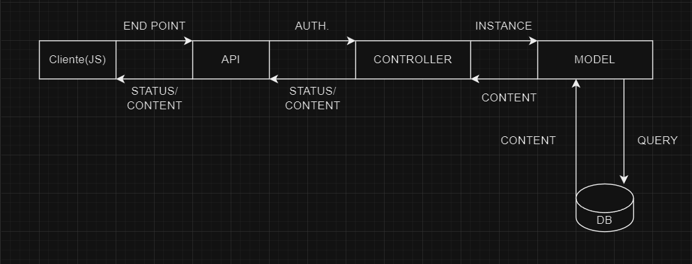

# Car Renting

El objetivo principal de este proyecto es realizar un código genérico 
que permita hacer un CRUD y un lógica independiente del dominio de la aplicación.
En este caso el dominio es un alquiler de coches básico.

## Tecnologías

- PHP 
  - Este será el lenguaje con el que se construirá la lógica de la aplicación (API).
- JavaScript
  - Este será el lenguaje con el que se construirán las llamadas fetch a la API.
- MySQL
  - Con el lenguaje SQL guardaremos todos los registros de la aplicación.
- HTML5/CSS3
  - Estos serán las tecnologías con las que maquetaremos la web.

## Arquitectura

